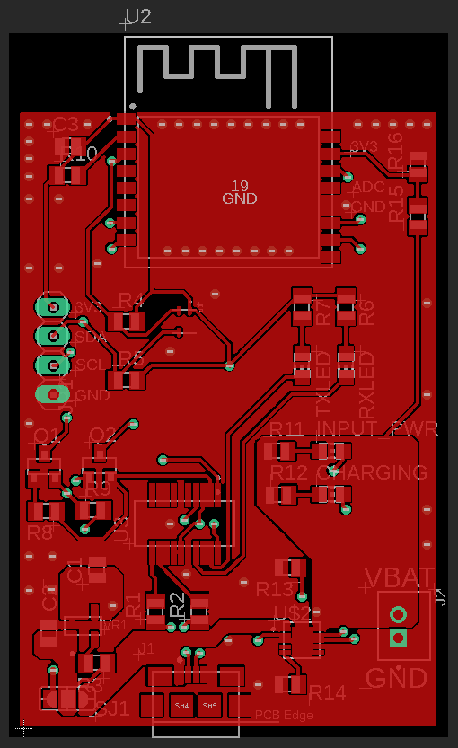
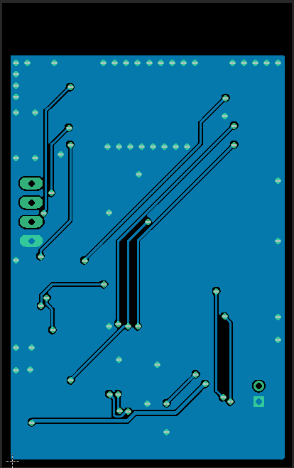

# ESP Based IoT reporter
Project and Source files for custom PCB that implements various sensors with an ESP for reporting

## Sponsored by PCBWay
This project was graciously sponsored by [PCBWay](https://www.pcbway.com/) who provided boards of the product. I've used them before and enjoy their service, as they provide an affordable way of creating professional PCBs for projects such as this one. Check them out!

## Purpose
This is mostly a learning exercise for more complex boards, and tighter integration with cloud stuff.
I wanted to make a board that uses an ESP8266 to measure various things and report them to a cloud service.
This first version includes just measuring temperature and humidity throughout the house, with the option to expand and measure other things through I2C or Analog.

It includes an FTDI chip to program the ESP, the ESP itself, a temp/humidity sensor, and a Lithium-Ion charger with a connector for a Li-ion battery if I want to place it somewhere out of reach.
The repo will also include source code once I get my first batch of boards in.

## Board Views
I don't have the physical boards currently, but I think it's always nice to see what the boards look like without downloading and viewing it through eagle.
So here's the Top and Bottom boardview from Eagle.

Have fun with it if you think it's cool.
